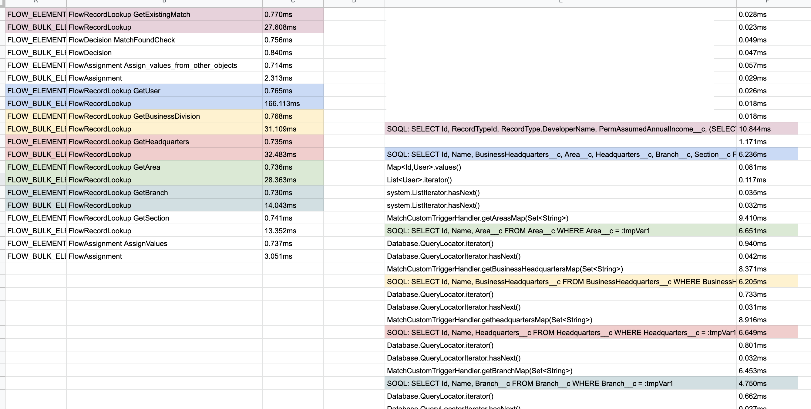

# Brief overview
While working with a client looking to integrate their ATS front end, I was asked to assist in debugging a slow performing Salesforce custom endpoint. During the course of the investigation, one of the major causes of poor performance turned out to be the numerous flows within the org with some flows taking over 2s each. The endpoint being investigated inserted numerous records accross 7 objects with over 50 unique flows being executed in a single transaction, with multiple flows triggering DML actions on other related objects therefore slowing performance further. 

As part of presenting potential solutions from this analysis, I investigated the performance difference between a before insert apex trigger and a record triggered flow before save, some of this investigation can be seen in here.

The below is an extract of some of the analysis performed, with the purpose of explaining the differences in performance of different approaches to a wide audience of team members with varying levels of Salesforce technical knowledge. 

# Extract from analysis documentation

## Flow vs Apex

### Initial analysis

Having gone through the logs produced multiple times, looking into the timing differences, one thing that stood out was the duration of time flows were taking to execute. One example I noticed in particular was a call to get the User of a match based on the owner of the record, where this was taking **424.241ms** to execute a FlowRecordLookup call which, in context of the log and the elements around it, looked like a long time. This lead me to run the same query, with the same data in the same org, where the Apex query (ran in the developer console for ease) took only **10.539ms** to run which seems odd as the difference to my mind should not be so large. \
 \
Looking at the transaction as a whole, there are **49** instances of FlowRecordLookup calls, with a total time of **2628ms** to execute all flow queries, of these the 424.241ms query was the largest which is likely why it jumped out at me.

When comparing this to the number of SOQL statements in the log, **135** queries are performed in apex, with a total time of **1607.323ms** the time taken to retrieve information from the database looks to be higher per call.

_NOTE: queries to the database perform differently depending on how the query filters for the data in question, this can have implications on query performance so all findings above should be taken as a high level analysis, not taking into account how performant the filtering of the individual queries are._

This initial investigation led me to look into the timing of a single flow as an example to see what performance gains could be made by implementing the functionality in Apex.

### Apex trigger vs flow testing

From the above findings, the “~~Record~~ Handler Before Insert” flow was chosen as the logic to replicate in code as this had the slowest performing query of all the flows to see what performance could be gained.

The functionality was replicated as like for like as possible into apex, with the difference of being able to utilise non-SOQL methods for certain functionality as well as combining queries where logical to do so. One of the main differences between Apex and Flow is that it is a lot more commonplace to check before performing a query to make sure you are only interacting with the database when strictly necessary, this allows for more performant code purely from the way the logic is written, it is not usually thought of when building logic in flows.

Once the Apex logic and the Flow were both matching in functionality, the way in which the test was performed was to run one of the Apex test methods in the system that inserts a record, this allows for a very easily replicable scenario to ensure the same test is performed for both types of logic.

The test was performed multiple times to try to ensure that differences in server load did not skew the results if the server was under more load during one test, the performance could be affected that way.

The below table shows the timings of the two different versions of the logic as recorded in debug logs downloaded from Salesforce when the tests were performed.

<table>
  <tr>
   <td>Test1
   </td>
   <td>
651.555

   </td>
   <td>
114.287

   </td>
  </tr>
  <tr>
   <td>Test2
   </td>
   <td>
555.342

   </td>
   <td>
65.566

   </td>
  </tr>
  <tr>
   <td>Test3
   </td>
   <td>
348.455

   </td>
   <td>
101.477

   </td>
  </tr>
  <tr>
   <td>Test4
   </td>
   <td>
362.652

   </td>
   <td>
48.974

   </td>
  </tr>
  <tr>
   <td>Test5
   </td>
   <td>
459.917

   </td>
   <td>
48.97

   </td>
  </tr>
  <tr>
   <td>Test6
   </td>
   <td>
372.284

   </td>
   <td>
97.907

   </td>
  </tr>
  <tr>
   <td><strong>Average</strong>
   </td>
   <td>
<strong>458.3675</strong>

   </td>
   <td>
<strong>79.53016667</strong>

   </td>
  </tr>
</table>

The average time taken shows clearly that the apex logic is faster to perform the same functionality.

The findings of this testing are similar to those found here: [Performance_Discussion__Same_Record_Field_Updates](https://architect.salesforce.com/design/decision-guides/trigger-automation#Performance_Discussion__Same_Record_Field_Updates) in the salesforce architecture decision guides documentation, where Apex Trigger logic performs faster than Flow logic in the scenarios tested there. 

As well as the overall analysis, one of the test examples was broken down further to see which parts of the flow and the apex logic were performing better or worse.

You can see from this screenshot that the time taken to perform a FlowRecordLookup when compared to the SOQL query in apex is slower in every single scenario in this sample. (similar logic highlighted in the same colour for ease of reading)
